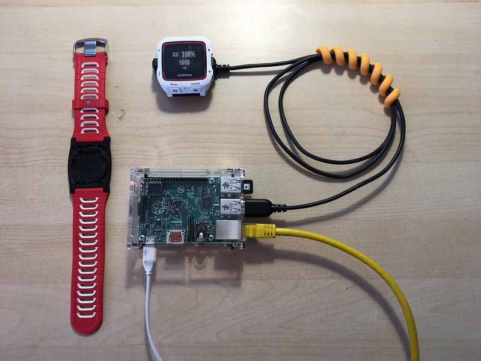

# Sync FIT files on a Raspberry PI

Use a [Raspberry PI](http://www.raspberrypi.org) to dowload FIT files from a
Garmin device and make them available over a network drive.  It can be used
for a complete offline solution of downloading FIT files for use with programs
such as [ActivityLog2](https://github.com/alex-hhh/ActivityLog2)
or [GoldenCheetah](http://www.goldencheetah.org/), without the need to attach
the USB charging cradle to a laptop or having to download them from a web
service.

This works as follows:

* The Raspberry Pi is connected to the local home network
* USB charging cradle is connected to a USB port on the Raspberry Pi
* When a Garmin Device is connected to the cradle for charging, all the FIT
  files are copied off the device onto a local folder.  At the same time,
  updated EPO data (for GPS quick sync) is copied onto the device.
* The downloaded FIT files are shared over a network folder on the local
  network
* On the laptop, the FIT files show up on a network drive and can be imported
  into ActivityLog2 or GoldenCheetah.

There is also support for downloading files using an ANT-FS USB stick, for
older Garmin Devices that use this method.  In that case the download is
initiated when the device comes in range of the Raspberry PI.

## Installation an Setup

### Setup network shares on the Raspberry PI

We will create two network shares.  A "FitFiles" read-only share accessible
with the "pi" user and your password.  FIT files will become available on that
share.  Another share, "PiDropbox" is a read-write share, that can be used to
transfer files onto the Raspberry PI (it is mapped to the Dropbox folder
inside the pi home folder).

To install samba run the following:

    sudo apt-get install samba samba-common-bin smbclient

Setup a SAMBA password for the `pi` user, (can be different than the login
password, but I like to keep them the same)

    sudo smbpasswd -a pi

To add exported shares for the Pi user, first create the directories to be
shared:

    mkdir ~/FitSync
    mkdir ~/Dropbox

Edit `/etc/samba/smb.conf` to enable user shares with password authenticated
users, add the following to the end.

    [FitFiles]
            comment=FIT files downloaded from devices
            valid users = pi
            read only = yes
            browseable = yes
            path=/home/pi/FitSync

    [PiDropbox]
            comment=Dropbox for the pi user
            valid users = pi
            read only = no
            browseable = yes
            path=/home/pi/Dropbox

### Install PiFitSync

#### Build and install libusb and other prerequisites

Packages `libudev`, `git`, `python3` and `rsync` will need to be installed
first:
  
    sudo apt-get install libudev-dev git rsync python3

Obtain libusb 1.0.18, copy it (via the Dropbox share) onto the RPI, than run:

    mkdir ~/pkg
    mv ~/Dropbox/libusb-1.0.18.tar.bz2 ~/pkg/
    cd ~/pkg
    tar xjf libusb-1.0.18.tar.bz2
    cd libusb-1.0.18
    ./configure
    make
    sudo make install
    
#### Build and install FitSync

Clone this repository on the Raspberry PI and run the following commands:
  
    cd src
    make
    sudo make install

#### Setup other directories

Create the mount point directories for the devices:

    sudo mkdir -p /media/garmin
    sudo mkdir -p /media/fly6

Create symlinks so we can access device locations them from the PI home
directory:
    
    ln -s /media/fly6 ~/fly6
    ln -s /media/garmin/GARMIN/ACTIVITY ~/fr920-activities
    ln -s /media/garmin/GARMIN/NEWFILES ~/fr920-newfiles

Create a symlink of the device name to the devices activities, so we can
browse directly to "X:\0-ByName\fr920" and won't have to remember the device
ID:
    
    mkdir ~/FitSync/0-ByName
    ### REPLACE with the real device serial number:
    ln -s ~/FitSync/3916163708/Activities ~/FitSync/0-ByName/fr920

